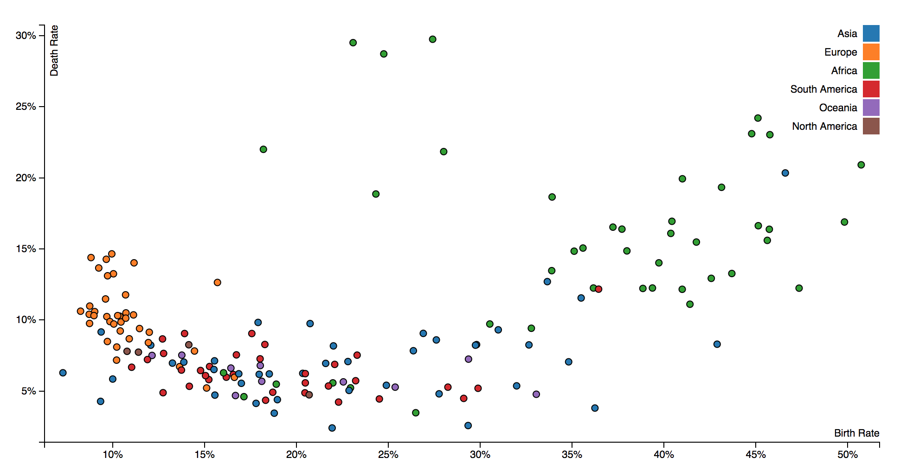
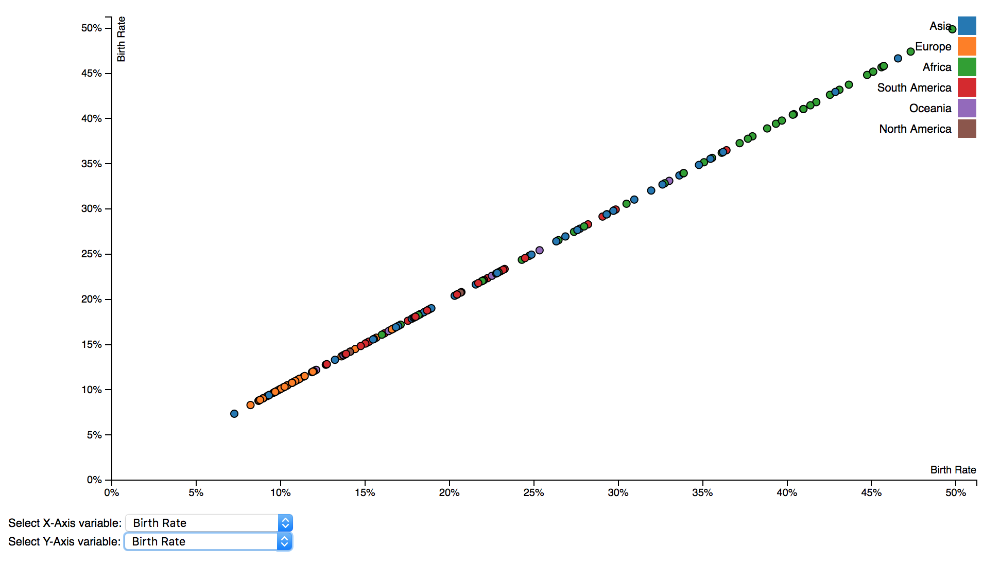
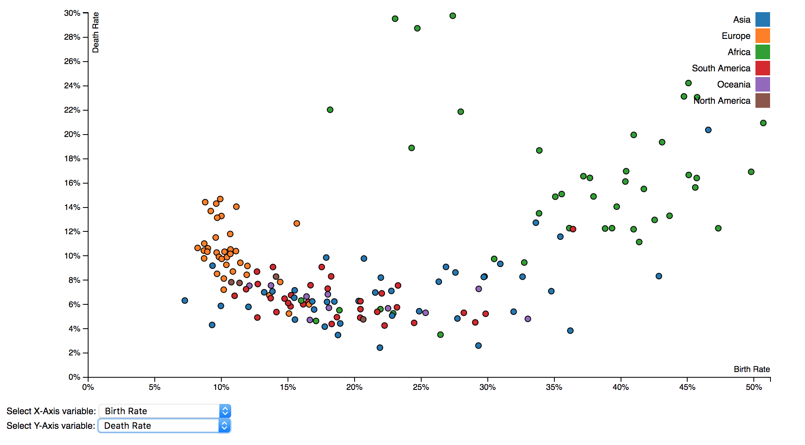
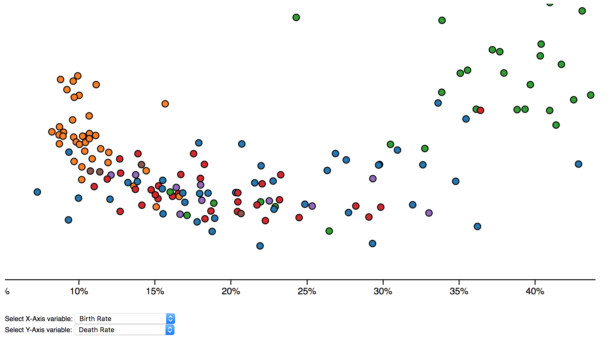

# Data_Visualization_Homework

### Installation

**python 3.0+**

**d3.v4.js**

> // enter the assignment directory
> 
> python -m http.server 8000
> 
> // open the browser
> 
> input localhost:8000 in url

#### Assign1
Version: d3.v3.js

#### Assign2
Version: d3.v4.js

- Drop-list function

- zoomable

